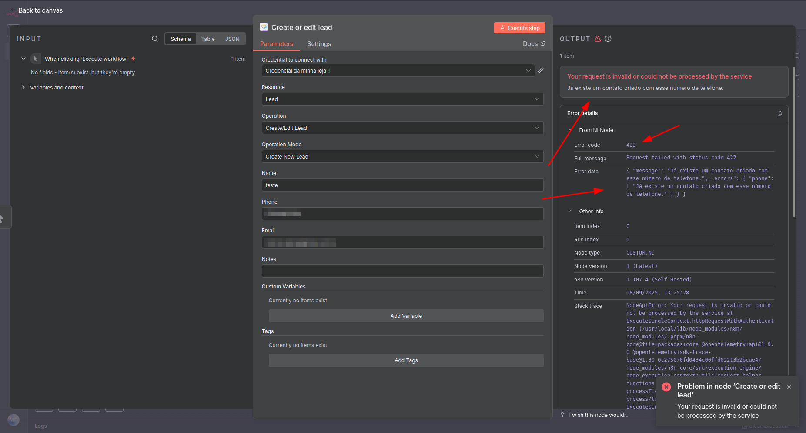
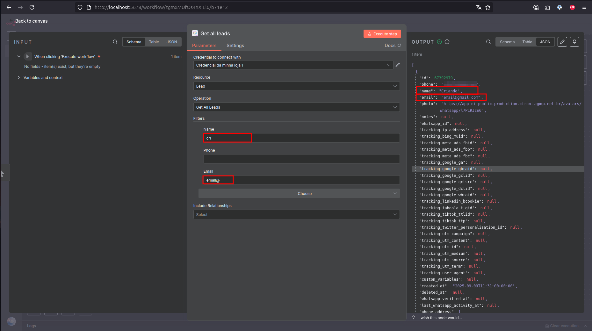
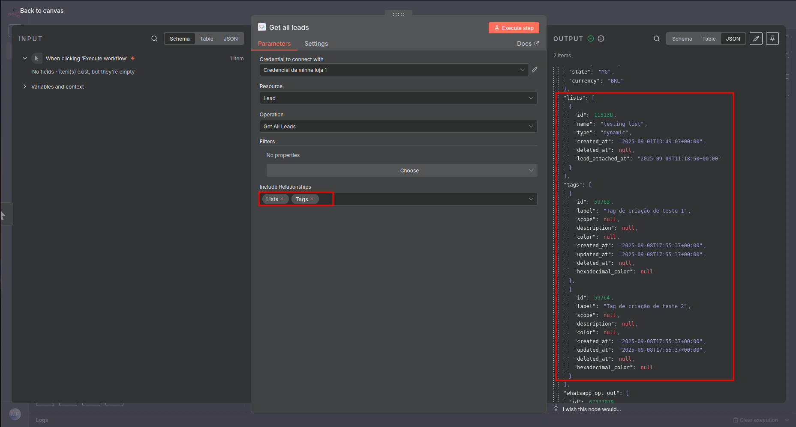

# Notificações Inteligentes

## What is Notificações Inteligentes?

[Notificações Inteligentes](https://notificacoesinteligentes.com/) is a company founded in 2015, focused on transforming the relationship between businesses and customers through message automation, especially via WhatsApp and other intelligent tools.

With almost 10 years in the market, it is part of Grupo GPM Participações e Tecnologias Ltda, offering robust automated communication solutions for thousands of clients across Brazil.

## Mission, Vision, and Values

The mission of Notificações Inteligentes is to empower companies with accessible and intelligent technology, helping them sell more, provide better service, and grow efficiently. The company believes in practical innovation that generates real value from the first customer contact.

The values are centered on:
*   **Effective and intuitive solutions**
*   **Focus on sustainable growth of client businesses**
*   **Excellence in service and continuous innovation**

---

## How the Platform Works and Its Usefulness

Notificações Inteligentes uses automation technology to transform data into strategic alerts, anticipate risks, automate processes, and ensure no sale is lost due to lack of communication.

The main products and features include:

*   [**GPT Chatbot**](https://notificacoesinteligentes.com/funcionalidades/chatbot-gpt): Intelligent chatbots using AI for automated interactions.
*   [**Automated Workflows**](https://notificacoesinteligentes.com/funcionalidades/workflow): Automate flows and send messages at the right time to engage leads.
*   [**Intelligent Recovery Tools**](https://notificacoesinteligentes.com/funcionalidades/recuperadores-inteligentes): Recover lost sales with automatic reminders.
*   [**Ad Platforms**](https://notificacoesinteligentes.com/funcionalidades/plataformas-de-anuncio): Optimize conversion sending and maximize ad performance.
*   [**Service Center**](https://notificacoesinteligentes.com/funcionalidades/central-de-atendimento): Centralize customer service, automate responses, and track metrics.
*   [**Chatbot**](https://notificacoesinteligentes.com/funcionalidades/chatbot): Provide 24/7 service with chatbots, capture leads, and scale your support.
*   [**Intelligent Lead Management**](https://notificacoesinteligentes.com/funcionalidades/gestao-de-leads): Store, manage, and track leads in the cloud conveniently.
*   [**Intelligent Redirectors**](https://notificacoesinteligentes.com/funcionalidades/redirecionadores-inteligentes): Redirect leads to multiple active WhatsApp numbers and track the origin.
*   [**Intelligent Notifications**](https://notificacoesinteligentes.com/funcionalidades/notificacoes-inteligentes): Send automatic notifications and boost engagement.
*   [**Campaigns**](https://notificacoesinteligentes.com/funcionalidades/campanhas): Schedule campaigns, segment contacts, and increase your conversions.
*   [**Pipeline Management**](https://notificacoesinteligentes.com/funcionalidades/pipelines): Manage your sales funnel and track negotiations in real-time.
*   [**Link Creation (URL Builder)**](https://notificacoesinteligentes.com/funcionalidades/url-builder): Create trackable URLs and enhance your marketing strategies.

The platform processes thousands of messages daily and is already a national reference in the automated communication segment, with over 15,000 companies served, using the solution to streamline processes, improve customer service, and increase operational efficiency.

---

## Why is Notificações Inteligentes Useful?

*   **Automates and scales** customer relationships, preventing lost sales due to lack of communication.
*   **Increases efficiency and agility** for sales, support, and marketing teams.
*   Facilitates **personalization and monitoring of interactions**, enabling faster and safer decisions.
*   Offers a **variety of integrations** with major market platforms, facilitating implementation in any business.
*   Operates **end-to-end**: from first contact to post-sale, including campaigns, notifications, automated service, and more.
*   Is **nationally recognized**, with a high volume of clients and success cases.

---

## Summary in One Sentence

Notificações Inteligentes is a leading platform in message automation and relationship management via WhatsApp, helping businesses of all sizes sell more, serve better, and grow with practical and intelligent technology.

---
# NI NODE AUTHENTICATION GUIDE

Welcome to the **Notificações Inteligentes Custom Node**!
This guide will help you **generate and configure your API Key (Bearer Token)** to authenticate and securely use all functionalities of your Custom Node.

## Accessing the Notificações Inteligentes Panel

1.  Open your browser and go to the [Notificações Inteligentes](https://notificacoesinteligentes.com) website.
2.  Click **Entrar (Login)** and log in with your account.

> Ensure you use the correct account that has access to the **Organizations** you want to manage via API.

---

## Generating the API Key (Bearer Token)

1.  After logging in, click **Organizações (Organizations)** in the top menu.
2.  Select the desired organization.
3.  Access **Configurações (Settings)**.
4.  Look for the **Chave de API (API Key)** section.
5.  Click **Gerar nova chave (Generate new key)**.

6.  A dialog box will be displayed:

   *   **Check the box** confirming you have saved the key in a secure location.
   *   Click **Concluir (Finish)**.

> The generated key will be used as the **Bearer Token** for Custom Node authentication.
> **Attention:** Keep this key secure! Do not share it publicly.

---

## Configuring the Custom Node

1.  In your integration environment (n8n), open the **Custom Node**.
2.  Locate the **Create new Credential / Bearer Token** field.

3.  Paste the key generated on the Notificações Inteligentes website.
4.  Save the settings.

5.  If there is any problem with the API key, an error message will appear.

> Your Custom Node is now ready to communicate securely with the API.

6.  If you have more than one organization, you can add more keys and organize the credentials according to each organization. To make identification easier, simply rename each credential.

---

## Testing the Connection

1.  Create a test action in the Custom Node, such as **Get All Integrations**.
2.  Execute the action.
3.  If everything is correct, you will see the data returned from the API.

> If any authentication error occurs, check if:
> *   The **Bearer Token** was copied correctly.
> *   The key has not expired.
> *   Your account has permission to access the chosen organization.

---

## ✅ Ready!

You can now use your **Custom Node** to create, edit and delete securely using your **API Key (Bearer Token)**.

---

## **Node Idea: How it Works and What to Expect**

*   The **NI (Notificações Inteligentes) Custom Node** is a tool that allows you to integrate and automate some functionalities of your NI account directly into your workflows.
*   The **central idea** is that you can manipulate data from your NI platform (such as Integrations, Leads, Lists, Events, and Variables) using standardized operations (CRUD: Create, Read, Update, Delete). The key to this manipulation are **Unique Identifiers (IDs)**.

### Main Concepts:

*   **Operation Base:** Almost all operations in the Node revolve around an **ID**.
    *   To manage an **Integration**, you need its `ID`.
    *   To edit a **Lead**, you need the `Lead ID`.
    *   To add leads to a **List**, you need the `List ID` and the `Lead IDs`.
    *   And so on for Variables and Groups.

*   **Typical Workflow:**
    *   **Search/Search All:** You will often start by using an operation like "Get All Integrations" or "Get All Leads" to get a list of items and their respective **IDs**.
    *   **Use the ID:** Then, you will use this **ID** in a subsequent operation in the same flow (like "Edit Lead", "Rename an Integration", or "Add Leads to List") to perform the desired action on the specific item.

*   **Error Handling and Confirmations:**

    *   **Success Confirmation:** All creation, editing, and deletion operations are validated by the platform. When successful, they return an explicit confirmation message, ensuring the user that the action was completed as expected.

    
    
    

    *   **Error Handling:** In case of failure, the node provides detailed and structured error responses, including:
        *   **Error Description:** A readable message explaining the nature of the problem.
        *   **HTTP Error Code:** The standard status code, allowing efficient technical debugging and the construction of robust conditional logic within the n8n flow.
    *   When related to an API-specific rule, in most cases it returns the detailed reason for the error, making it even clearer.

    

    *   All errors return the error code. In the example below, it returned 404 (Not Found) because it didn't find any ID related to what we tried to delete in the account.

    

*   **Additional Data:**
    *   Besides IDs, the Node allows working with a range of complementary (optional) data to enrich your automations, such as **Tags**, **Custom Variables**, **Filters**, and **Relationships**.
    *   In search fields, for example, where plausible, there is an option to receive additional data in the request.
    *   **Filters** allow filtering of data to be received. You can filter by one or more filters at the same time.

    

    *   **Include Relationships** allows adding more data to be received by the API. More than one option can also be used for the search.

    

In summary, the Node transforms the NI API into visual and intuitive blocks in n8n, where the main currency of operation are **IDs**, allowing you to build complex and personalized automations to manage your communication and contact base efficiently.

---

# NI NODE FUNCTIONS GUIDE

## Usage Guide - Integration (n8n)

## Overview
The Integration resource allows you to create, search, update, and list integrations connected to your account directly from n8n.

## Available Operations

### Create New Integration
Creates a new integration connecting your platform to the system.

**Required Fields:**
- Name: Give a friendly name to identify the integration (e.g., "My Shopify Store")
- Platform: Specify the platform (e.g., shopify-next, hotmart-v2, wooocommerce, etc). See the list of supported platforms in the field description.

**Important Note:** Only integrations created with the api-next platform can add or remove leads from your lead list via the API.

**How to use:** Select the "Create New Integration" operation, fill in the name and platform, and execute. The integration will be created and listed in your panel.

### Get All Integrations
Lists all integrations already registered in your account.

**No fields need to be filled in.**

**Returns a list with all registered names and platforms.**

**How to use:** Select "Get All Integrations" and execute. You will see the complete list of integrations.

### Get Integration
Allows querying the detailed data of a specific integration.

**Required Fields:**
- ID: The unique identifier of the integration you want to query (you can copy this ID when listing all integrations).

**Additional Parameters (optional):**
- You can choose to include extra fields in the response, such as "Available Events", "Setup Fields", or "Checklist"
- Just mark the ones you want detailed

**How to use:** Select "Get an Integration", enter the ID, select (if desired) any additional parameters, and execute.

### Edit Integration Name
Updates the name of an existing integration.

**Required Fields:**
- ID: The identifier of the integration you want to rename
- New Name: The new name to display in the panel

**How to use:** Select "Edit Integration Name", enter the ID and the new name, and execute.

### Delete Integration
Permanently removes an Integration from the system.

**Required Field:**
- Integration ID: Identifier of the integration to be removed

**How to use:** Select "Delete Integration", enter the Integration ID, and execute. A confirmation message will be displayed if the operation is successful.

## Special Fields
- Name: Integration name (up to 100 characters)
- Platform: Integration platform (consult the list in the field description)
- ID: Unique integration identifier, usually provided when creating or listing integrations
- Additional Parameters: Check to include extra information in the integration search

## Tips
- Use "Get All Integrations" to find the ID of the integration you want to edit or query
- Always check the required fields (marked with *) before executing
- For platforms, consult the examples in the field description to avoid typing errors

[Additional information about Integrations in NI](https://ajuda.notificacoesinteligentes.com/pt-br/article/como-conectar-mrlog2/)

---

## Usage Guide - Leads (n8n)

## Overview
The **Leads** feature allows you to manage contacts directly through n8n, with support for custom variables, tags, and advanced filters.

## Available Operations

### 🆕 **Create Lead**
Creates a new contact in the system.

**Required Fields:**
- `Name` - Lead's full name
- `Phone` - Phone number with area code and region code
- `Email` - Email address

**Optional Fields:**
- `Notes` - Additional observations
- `Custom Variables` - Extra personalized data (CPF, birth date, etc)
- `Tags` - Keywords for categorization
- `Tracking Data` - Trackable information from website actions

**Important:** Custom variables must use the correct data type (e.g., CPF field must contain only numbers).

###  **Update Lead**
Modifies data of an existing lead.

**Required Fields:**
- `Lead ID` - Unique lead identifier
- `Name` - Updated name
- `Email` - Updated email

### **Create or Update Lead**
Smart operation that automatically checks if lead exists by phone number.

** Important:** The `Phone` field must include country code with `+` (e.g., +5511999999999).

### **Tag Management**

**Add Tags to a Lead**
- `Lead ID` + `Tags` - Adds new tags to existing lead

**Update Lead Tags**
- `Lead ID` + `Tags` - **Completely replaces** previous tags

**Delete Tags from a Lead**
- `Lead ID` + `Tags` - Removes specific tags from lead

### **Search and Query**

**Search All Leads**
- Lists all registered contacts
- **Optional filters:** name, phone, email, tags
- `Include Relationships` - Includes related lists, tags and sources

**Search Lead by ID**
- Returns complete data of a specific lead
- **Required field:** `Lead ID`
- **Optional:** Include relationships

### **Delete Lead**
Permanently removes a lead from the system.

**Required Field:**
- `Lead ID` - Identifier of lead to be removed

---

## Useful Links
 [Complete Documentation](https://ajuda.notificacoesinteligentes.com/pt-br/article/gerenciamento-de-leads-1x8lj7m/)

---

#### If you haven't found what you're looking for, take a look at our [Help Center](https://ajuda.notificacoesinteligentes.com/pt-br/).
