# Notificações Inteligentes

## O que é a Notificações Inteligentes?

A [Notificações Inteligentes](https://notificacoesinteligentes.com/) é uma empresa fundada em 2015, focada em transformar o relacionamento entre empresas e clientes por meio da automação de mensagens, especialmente pelo WhatsApp e outras ferramentas inteligentes.

Com quase 10 anos de mercado, faz parte do Grupo GPM Participações e Tecnologias Ltda, oferecendo soluções robustas de comunicação automática para milhares de clientes em todo o Brasil.

## Missão, visão e valores

A missão da Notificações Inteligentes é empoderar empresas com tecnologia acessível e inteligente, ajudando-as a vender mais, atender melhor e crescer com eficiência. A empresa acredita na inovação prática, que gera valor real desde o primeiro contato com o cliente.

Os valores estão centrados em:
* Soluções eficazes e intuitivas
* Foco no crescimento sustentável dos negócios dos clientes
* Atendimento de excelência e inovação contínua

---

## Como a plataforma funciona e qual sua utilidade

A Notificações Inteligentes utiliza tecnologia de automação para transformar dados em alertas estratégicos, antecipar riscos, automatizar processos e garantir que nenhuma venda seja perdida por falta de comunicação.

Os principais produtos e recursos incluem:

* [Chatbot GPT](https://notificacoesinteligentes.com/funcionalidades/chatbot-gpt): Chatbots inteligentes que utilizam IA para interações automatizadas.
* [Workflows automatizados](https://notificacoesinteligentes.com/funcionalidades/workflow): Automatize fluxos e envie mensagens no momento certo para engajar leads.
* [Recuperadores Inteligentes](https://notificacoesinteligentes.com/funcionalidades/recuperadores-inteligentes): Recupere vendas perdidas com lembretes automáticos.
* [Plataformas de Anúncio](https://notificacoesinteligentes.com/funcionalidades/plataformas-de-anuncio): Otimize o envio de conversões e maximize o desempenho dos anúncios.
* [Central de Atendimento](https://notificacoesinteligentes.com/funcionalidades/central-de-atendimento): Centralize atendimentos, automatize respostas e acompanhe métricas.
* [Chatbot](https://notificacoesinteligentes.com/funcionalidades/chatbot): Atenda 24/7 com chatbots, capture leads e escale seu suporte.
* [Gestão Inteligente de Leads](https://notificacoesinteligentes.com/funcionalidades/gestao-de-leads): Armazene, gerencie e acompanhe leads na nuvem com praticidade.
* [Redirecionadores Inteligentes](https://notificacoesinteligentes.com/funcionalidades/redirecionadores-inteligentes): Redirecione leads para múltiplos WhatsApps ativos e rastreie a origem.
* [Notificações Inteligentes](https://notificacoesinteligentes.com/funcionalidades/notificacoes-inteligentes): Envie notificações automáticas e impulsione o engajamento.
* [Campanhas](https://notificacoesinteligentes.com/funcionalidades/campanhas): Programe campanhas, segmente contatos e aumento suas conversões.
* [Gerenciamento de Pipelines](https://notificacoesinteligentes.com/funcionalidades/pipelines): Gerencie seu funil de vendas e acompanhe negociações em tempo real.
* [Criação de Links (URL Builder)](https://notificacoesinteligentes.com/funcionalidades/url-builder): Crie URL's rastreáveis e aprimore suas estratégias de marketing.

A plataforma processa milhares de mensagens diariamente e já é referência nacional no segmento de comunicação automatizada, com mais de 15 mil empresas atendidas, que utilizam a solução para agilizar processos, melhorar o atendimento e aumentar a eficiência operacional.

---

## Por que a Notificações Inteligentes é útil?

* Automatiza e escala o relacionamento com clientes, evitando perdas de vendas por falta de comunicação.
* Aumenta a eficiência e a agilidade dos times de vendas, suporte e marketing.
* Facilita a personalização e o monitoramento de interações, permitindo decisões mais rápidas e seguras.
* Oferece uma variedade de integrações com as principais plataformas do mercado, facilitando a implantação em qualquer negócio.
* Atua de ponta a ponta: do primeiro contato até o pós-venda, incluindo campanhas, notificações, atendimento automatizado e mais.
* É reconhecida nacionalmente, com alto volume de clientes e casos de sucesso.

---

## Resumo em uma frase

A Notificações Inteligentes é uma plataforma líder em automação de mensagens e relacionamento via WhatsApp, que ajuda empresas de todos os portes a vender mais, atender melhor e crescer com tecnologia prática e inteligente.

---
# GUIA DE AUTENTICAÇÃO DO NODE DO NI

Bem-vindo ao **Custom Node da Notificações Inteligentes**!
Este guia irá te ajudar a **gerar e configurar sua API Key (Bearer Token)** para autenticar e utilizar todas as funcionalidades do seu Custom Node de forma segura.

## Acessando o Painel de Notificações Inteligentes

1. Abra seu navegador e acesse o site [Notificações Inteligentes](https://notificacoesinteligentes.com).
2. Clique em **Entrar** e faça login com a sua conta.

> Certifique-se de usar a conta correta que tem acesso às **Organizações** que deseja gerenciar via API.

---

## Gerando a API Key (Bearer Token)

1. Após login, no menu superior, clique em **Organizações**.
2. Selecione a organização desejada.
3. Acesse **Configurações**.
4. Procure a seção **Chave de API**.
5. Clique em **Gerar nova chave**.

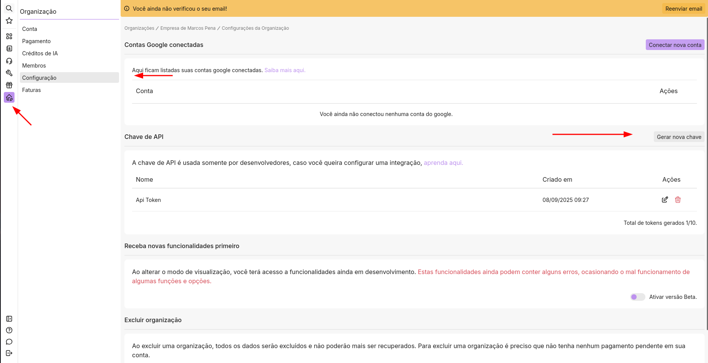

6. Uma caixa de diálogo será exibida:

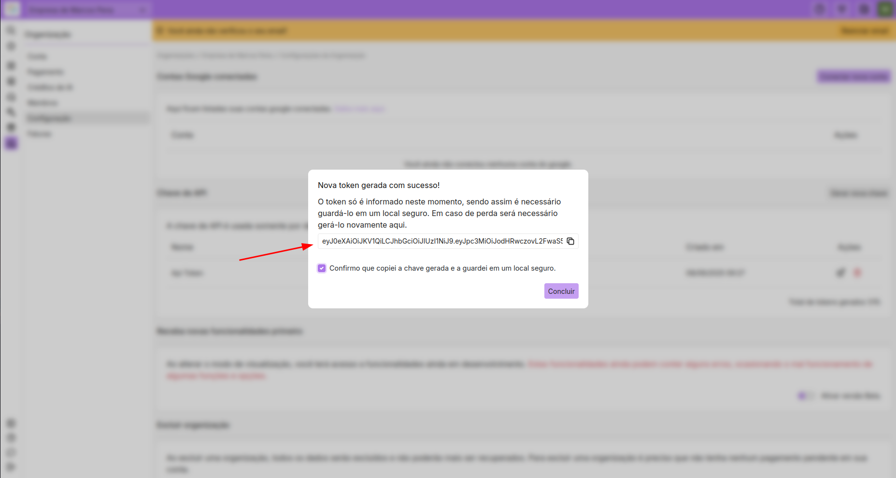

   * **Marque a caixinha** confirmando que você guardou a chave em um local seguro.
   * Clique em **Concluir**.

> A chave gerada será usada como **Bearer Token** para autenticação do Custom Node.
> **Atenção:** Guarde essa chave com segurança! Não compartilhe publicamente.

---

## Configurando o Custom Node

1. No seu ambiente de integração (n8n), abra o **Custom Node**.
2. Localize o campo **Create new Credential / Bearer Token**.

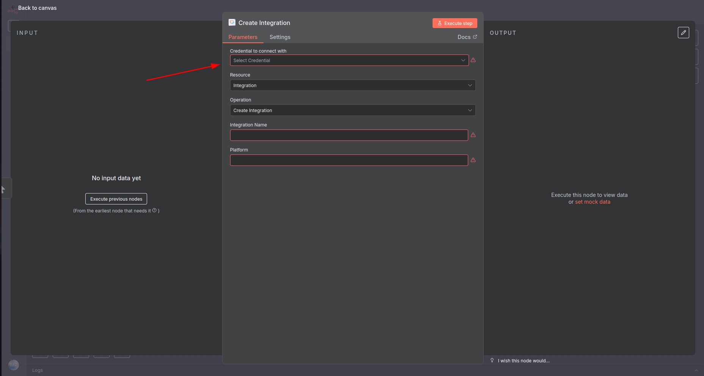

3. Cole a chave gerada no site da Notificações Inteligentes.
4. Salve as configurações.

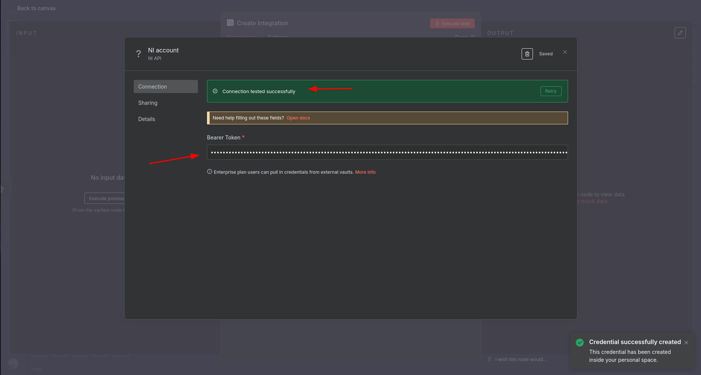

5. Caso houver algum problema com a chave API, uma mensagem de erro aparecerá. 

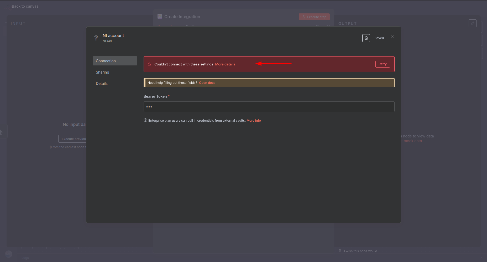

> Seu Custom Node está agora pronto para se comunicar de forma segura com a API.

6. Caso tiver mais de uma organização, é possível adicionar mais de uma chave e organizar as credenciais conforme cada organização. Pra facilitar a identificação basta renomear cada credencial.

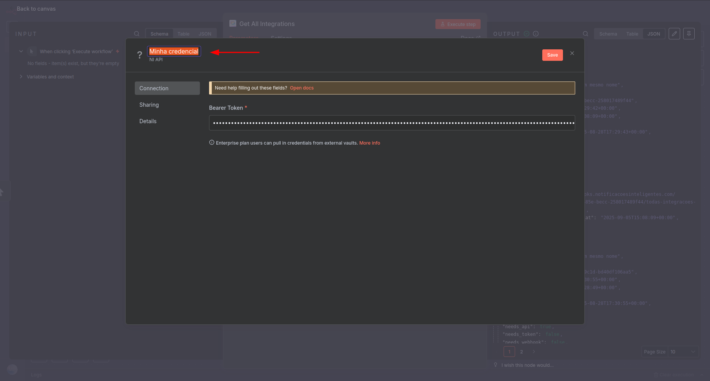

---

## Testando a Conexão

1. Crie uma ação de teste no Custom Node, como **Get All Integrations**.
2. Execute a ação.
3. Se tudo estiver correto, você verá os dados retornados da API.

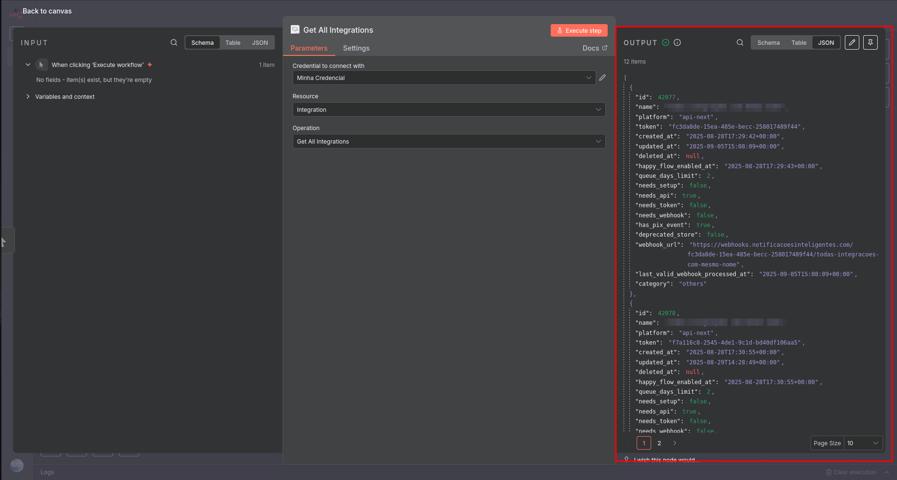

> Caso ocorra algum erro de autenticação, verifique se:
> * O **Bearer Token** foi copiado corretamente.
> * A chave não expirou.
> * Sua conta tem permissão para acessar a organização escolhida.

---

## ✅ Pronto!

Agora você pode utilizar seu **Custom Node** para criar, editar, excluir ou consultar variáveis customizadas com segurança, utilizando sua **API Key (Bearer Token)**.

---

## **Ideia do Node: Como funciona e o que esperar**

* O **Custom Node do NI (Notificações Inteligentes)** é uma ferramenta que permite integrar e automatizar algumas das funcionalidades da sua conta NI diretamente nos seus fluxos de trabalho (workflows).

* A **ideia central** é que você pode manipular os dados da sua plataforma NI (como Integrações, Leads, Listas, Eventos e Variáveis) usando operações padronizadas (CRUD: Criar, Buscar, Atualizar e Deletar). A chave para essa manipulação são os **Identificadores Únicos (IDs)**.

### Principais Conceitos:

  * **Base de Operação:** Quase todas as operações no Node giram em torno de um **ID**.
    - Para gerenciar uma **Integração**, você precisa do seu `ID`.
    - Para editar um **Lead**, você precisa do `ID do Lead`.
    - Para adicionar leads a uma **Lista**, você precisa do `ID da Lista` e dos `IDs dos Leads`.
    - E assim por diante para Variáveis e Grupos.

*  **Fluxo de Trabalho Típico:**
   * **Buscar/Buscar Todos:** Você frequentemente começará usando uma operação como "Buscar Todas as Integrações" ou "Buscar Todos os Leads" para obter uma lista de itens e seus respectivos **IDs**.
   * **Usar o ID:** Em seguida, você utilizará esse **ID** em uma operação subsequente no mesmo fluxo (como "Editar Lead", "Mudar o Nome de uma Integração" ou "Adicionar Leads à Lista") para realizar a ação desejada no item específico.

*  **Tratamento de Erros e Confirmações:**

   * **Confirmação de Sucesso:** Todas as operações de criação, edição e exclusão são validadas pela plataforma. Ao serem bem-sucedidas, retornam uma mensagem de  confirmação explícita, garantendo ao usuário que a ação foi concluída conforme esperado.

   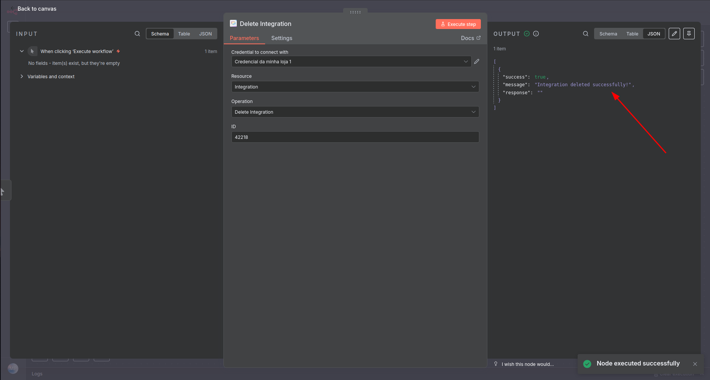

	 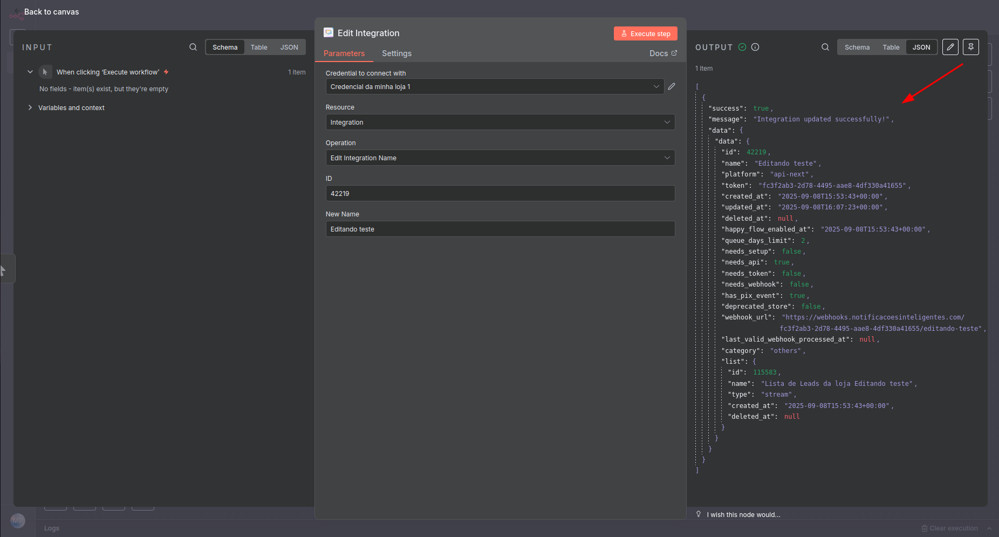

	 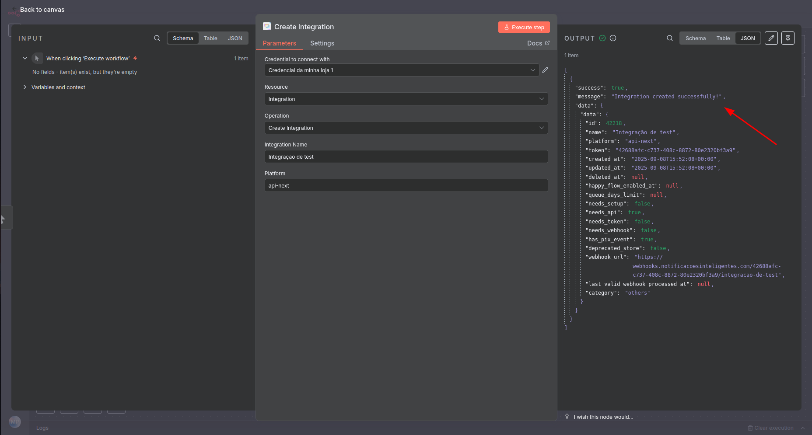

   * **Tratamento de Erros:** Em caso de falha, o node fornece respostas de erro detalhadas e estruturadas, incluindo:
   * Descrição do Erro: Uma mensagem legível que explica a natureza do problema.
   * Código de Erro HTTP: O código de status padrão, permitindo uma depuração técnica eficiente e a construção de lógicas condicionais robustas dentro do fluxo do n8n.

	 * Quando relacionado a alguma regra própria da API, na maioria dos casos ela retorna o motivo do erro, deixando ainda mais claro. 

	 

	 * Em todos os erros são retornados o código de erro. No caso de exemplo abaixo, retornou 404 (Not Found) pois não encontrou nenhum ID relacionado ao que tentamos apagar na conta.

   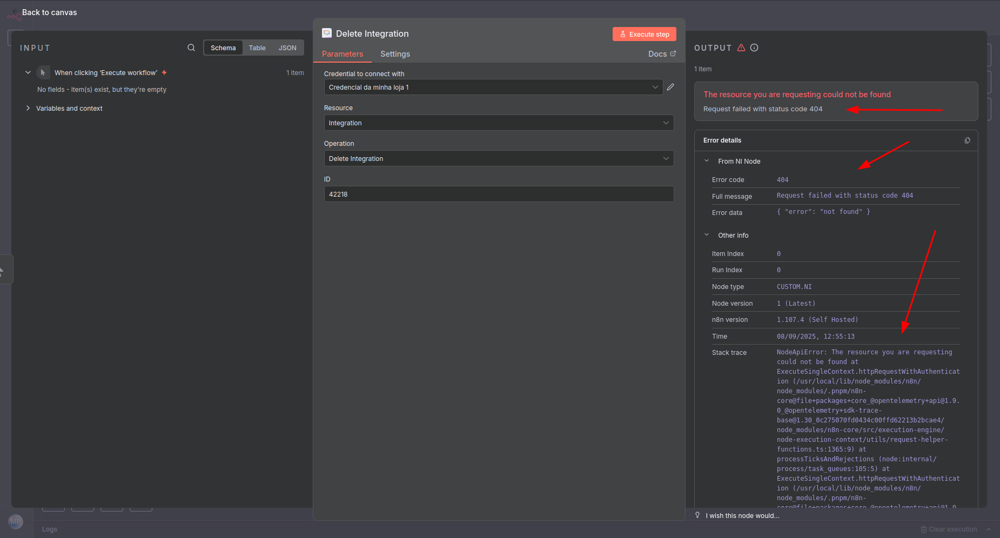

   ### Dados adicionais: 
	 Além dos IDs, o Node permite trabalhar com uma gama de dados complementares (opcionais) para enriquecer suas automações, como **Tags**, **Variáveis Customizadas**, **Filtros** e **Relacionamentos**.

	 * Em campos de busca por exemplo, caso plausível, existe a opção de receber dados adicionais na requisição. 

Em resumo, o Node transforma a API do NI em blocos visuais e intuitivos no n8n, onde a principal moeda de operação são os **IDs**, permitindo que você construa automações complexas e personalizadas para gerenciar sua comunicação e base de contatos de forma eficiente.

---

# GUIA DAS FUNÇÕES DO NODE DO NI

## Guia de Uso - Integração (n8n)

* O recurso Integração permite criar, buscar, atualizar e listar integrações conectadas à sua conta, diretamente pelo n8n.

### Operações Disponíveis

### Criar Nova Integração
- Cria uma nova integração conectando sua plataforma ao sistema.

#### Campos obrigatórios:
- Nome: Dê um nome amigável para identificar a integração (ex: "Minha Loja Shopify").
- Plataforma: Especifique a plataforma (ex: shopify-next, hotmart-v2, wooocommerce, etc). Veja na descrição do campo a lista de plataformas suportadas.

#### Como usar
Selecione a operação "Criar Nova Integração", preencha nome e plataforma, e execute.
A integração será criada e listada em seu painel.

#### Buscar Todas Integrações
Lista todas as integrações já cadastradas na sua conta.

#### Nenhum campo precisa ser preenchido.

Retorna uma lista com todos os nomes e plataformas cadastrados.

#### Como usar:
Selecione "Buscar Todas Integrações" e execute.
Você verá a lista completa de integrações.

### Buscar uma Integração
Permite consultar os dados detalhados de uma integração específica.

#### Campos obrigatórios:
- ID: O identificador único da integração que você quer consultar (você pode copiar esse ID ao listar todas as integrações).

#### Parâmetros Adicionais (opcional):
- Você pode escolher incluir campos extras na resposta, como "Eventos Disponíveis", "Setup Fields", ou "Checklist".
- Basta marcar os que deseja ver detalhados.

#### Como usar:
Selecione "Buscar uma Integração", informe o ID, selecione (se quiser) algum parâmetro adicional, e execute.

#### Mudar o Nome de uma Integração
Atualiza o nome de uma integração existente.
#### Campos obrigatórios:
- ID: O identificador da integração que você quer renomear.
- Novo Nome: O novo nome para exibir no painel.
#### Como usar:
Selecione "Mudar o Nome de uma Integração", informe o ID e o novo nome, e execute.

#### Campos Especiais
- **Nome:** Nome da integração (até 100 caracteres).
- **Plataforma:** Plataforma da integração (consulte a lista na descrição do campo).
- **ID:** Identificador único da integração, normalmente fornecido ao criar ou ao listar integrações.
- **Parâmetros Adicionais:** Marque para incluir informações extras na busca da integração.

#### Dicas
- Use "Buscar Todas Integrações" para descobrir o ID da integração que você deseja editar ou consultar.
- Sempre verifique os campos obrigatórios (marcados com *) antes de executar.
- Para plataformas, consulte os exemplos na descrição do campo para evitar erros de digitação.

[Informações adicionais acerca das Integrações no NI](https://ajuda.notificacoesinteligentes.com/pt-br/article/como-conectar-mrlog2/)

## Guia de Uso - Leads (n8n)

* O recurso Leads permite cadastrar, buscar, editar, apagar e gerenciar listas de leads (contatos) em sua plataforma diretamente pelo n8n, com suporte a variáveis customizadas, tags e filtros avançados.

### Operações Disponíveis

#### Criar Lead
Cria um novo lead (contato) no sistema.
**Campos obrigatórios:**
- Nome: Nome completo do lead.
- Telefone: Número de telefone, incluindo DDD.
- E-mail: Endereço de e-mail do lead.
**Campos opcionais:**
- Notas: Observações adicionais sobre o lead.
- Variáveis Customizadas: Permite adicionar variáveis extras personalizadas para cada lead (ex: CPF, data de nascimento, etc).
- Tags: Adicione palavras-chave para agrupar ou categorizar leads (ex: "cliente VIP", "prospecto").
**Como usar:**
Selecione "Criar Lead", preencha os campos obrigatórios e, se desejar, inclua notas, tags ou variáveis customizadas. Execute para cadastrar o lead.

#### Buscar Todos os Leads
Lista todos os leads cadastrados no sistema.
**Campos opcionais:**
- Filtros: Permite filtrar por nome, telefone, e-mail ou tag.
- Incluir Relacionamentos: Marque para trazer dados relacionados, como listas, tags, fonte das listas ou usuários associados.
**Como usar:**
Selecione "Buscar Todos os Leads", defina os filtros desejados (ou deixe em branco para listar todos) e execute.

#### Buscar Lead por ID
Retorna os dados completos de um lead específico a partir do seu identificador único.
**Campos obrigatórios:**
- ID do Lead: Insira o ID do lead desejado (pode ser obtido ao listar todos).
**Campos opcionais:**
- Incluir Relacionamentos: Escolha trazer listas, tags ou usuários relacionados.
**Como usar:**
Selecione "Buscar Lead por ID", informe o ID do lead e, se quiser, marque os relacionamentos a incluir. Execute para ver detalhes completos.

#### Editar Lead
Permite atualizar os dados de um lead existente.
**Campos obrigatórios:**
- ID do Lead: Identificador do lead a ser editado.
- Nome: Nome atualizado do lead.
- E-mail: E-mail atualizado do lead.
**Campos opcionais:**
- Notas: Atualize ou adicione observações.
- Variáveis Customizadas: Altere ou adicione variáveis personalizadas.
**Como usar:**
Selecione "Editar Lead", informe o ID, atualize os campos desejados e execute.

#### Apagar Lead
Remove um lead de forma permanente do sistema.
**Campo obrigatório:**
- ID do Lead: Identificador do lead a ser removido.
**Como usar:**
Selecione "Apagar Lead", informe o ID do lead e execute.
Uma mensagem de confirmação será exibida se a operação for bem-sucedida.

#### Adicionar Listas a um Lead
Associa uma ou mais listas ao lead informado.
**Campos obrigatórios:**
- ID do Lead: Identificador do lead.
- ID(s) da(s) Lista(s): IDs das listas para associar (ex: 1234, 5678).
**Como usar:**
Selecione "Adicionar Listas a um Lead", informe o ID do lead e as listas (separadas por vírgula). Execute para associar.

#### Remover Listas de um Lead
Remove uma ou mais listas associadas ao lead.
**Campos obrigatórios:**
- ID do Lead: Identificador do lead.
- ID(s) da(s) Lista(s): IDs das listas para remover (ex: 1234, 5678).
**Como usar:**
Selecione "Remover Listas de um Lead", informe o ID do lead e das listas. Execute para remover.

### Campos Especiais
- **Variáveis Customizadas:** Permite adicionar pares slug/valor ao lead (ex: slug="cpf", valor="123.456.789-00").
- **Tags:** Palavras-chave para agrupar leads, inseridas como lista.
- **Filtros:** Campos de busca para filtrar leads por nome, telefone, e-mail ou tag.
- **Incluir Relacionamentos:** Escolha trazer junto listas, tags, usuários e outras informações conectadas ao lead.
- **ID(s) da(s) Lista(s):** IDs de listas separados por vírgula, usados para adicionar ou remover múltiplas listas de uma vez.

### Dicas
- Use "Buscar Todos os Leads" para encontrar o ID de um lead.
- Para campos como listas, separe os IDs por vírgula e não use espaços extras.
- O sistema exige campos obrigatórios, mas aproveite os campos opcionais para detalhar melhor seu lead e facilitar automações.
- Variáveis customizadas são ideais para dados específicos do seu negócio.
- Sempre revise os dados antes de executar ações de deleção, pois não são reversíveis.

[Informações adicionais acerca de Leads no NI](https://ajuda.notificacoesinteligentes.com/pt-br/article/gerenciamento-de-leads-1x8lj7m/)

## Guia de Uso - Listas de Leads (n8n)

* O recurso Listas de Leads permite criar, buscar, filtrar, editar e gerenciar grupos de contatos no seu sistema de leads diretamente pelo n8n. Com esse recurso, você pode automatizar o agrupamento de leads, consultar dados detalhados e realizar ações em lote.

### Operações Disponíveis

#### Buscar Todas as Listas
Retorna todas as listas de contatos cadastradas no sistema, permitindo filtros avançados.
**Campos opcionais:**
- Incluir Relacionamentos: Escolha incluir na resposta detalhes como fonte (source) ou a contagem de leads.
- Mais Propriedades: Permite filtrar listas que "contêm leads".
- Filtros: Permite filtrar listas por nome ou tipo.
**Como usar:**
Selecione "Buscar Todas as Listas", defina filtros e relacionamentos desejados e execute para listar todas as listas disponíveis.

#### Criar Lista
Cria uma nova lista de contatos/leads.
**Campos obrigatórios:**
- Nome da Lista: Defina o nome da nova lista.
**Campos opcionais:**
- Tags: Adicione palavras-chave à lista para facilitar o agrupamento.
- O tipo é sempre criado como "dinâmico".
**Como usar:**
Selecione "Criar Lista", preencha o nome, adicione tags (opcional) e execute para criar a lista.

#### Buscar Lista por ID
Consulta os dados completos de uma lista específica a partir do seu identificador único.
**Campo obrigatório:**
- ID da Lista: Insira o identificador da lista que deseja consultar.
**Campos opcionais:**
- Incluir Detalhes da Fonte: Marque para trazer detalhes da origem da lista.
**Como usar:**
Selecione "Buscar Lista por ID", preencha o ID e marque detalhes extras caso deseje.

#### Listar Leads da Lista
Lista todos os leads pertencentes a uma lista específica.
**Campo obrigatório:**
- ID da Lista: Identificador da lista de onde deseja ver os leads.
**Campos opcionais:**
- Incluir Relacionamentos: Marque para incluir detalhes como listas relacionadas ou fonte das listas.
- Filtros: Permite filtrar os leads por nome, telefone ou e-mail dentro dessa lista.
**Como usar:**
Selecione "Listar Leads da Lista", informe o ID da lista, defina filtros ou relacionamentos e execute para ver todos os leads dessa lista.

#### Adicionar Leads à Lista
Adiciona um ou mais leads já cadastrados a uma lista específica.
**Campos obrigatórios:**
- ID da Lista: Identificador da lista que vai receber os leads.
- ID(s) do(s) Lead(s): IDs dos leads a serem adicionados (separe por vírgula, ex: 12,34,56).
**Como usar:**
Selecione "Adicionar Leads à Lista", informe o ID da lista e os IDs dos leads, separados por vírgula, e execute.

#### Remover Leads da Lista
Remove um ou mais leads de uma lista específica.
**Campos obrigatórios:**
- ID da Lista: Identificador da lista.
- ID(s) do(s) Lead(s): IDs dos leads que deseja remover da lista (separe por vírgula).
**Como usar:**
Selecione "Remover Leads da Lista", preencha o ID da lista e os IDs dos leads a remover, e execute.

### Campos Especiais
- **Incluir Relacionamentos:** Permite trazer detalhes adicionais sobre a lista ou os leads dentro dela, como origem e quantidade.
- **Mais Propriedades:** Use para filtrar listas que contenham leads.
- **Filtros (das listas):** Filtre pelo nome ou tipo da lista.
- **Filtros (dos leads da lista):** Filtre leads de uma lista específica por nome, telefone ou e-mail.
- **Tags:** Palavras-chave usadas para organizar e classificar listas.
- **ID da Lista:** Código único para cada lista de contatos.
- **ID(s) do(s) Lead(s):** Um ou mais códigos de leads a serem adicionados ou removidos de listas (sempre separados por vírgula).

### Dicas
- Use "Buscar Todas as Listas" para encontrar o ID de uma lista rapidamente.
- Para adicionar ou remover vários leads de uma vez, separe sempre os IDs por vírgula (ex: 101,102,205).
- O uso de tags facilita muito o agrupamento e automações futuras.
- Filtros permitem buscas e ações altamente segmentadas, otimizando o gerenciamento de grandes bases de leads.
- O recurso "Listar Leads da Lista" é ideal para consultar leads de uma campanha ou segmento específico.

[Informações adicionais acerca de Listas de Leads no NI](https://ajuda.notificacoesinteligentes.com/pt-br/article/listas-de-leads-1tdvrll/)

## Guia de Uso - Variável Customizada (n8n)

* O recurso Variável Customizada permite criar, buscar, atualizar e apagar variáveis customizadas associadas à sua organização, facilitando a configuração dinâmica e personalizada de integrações diretamente no n8n.

### Operações Disponíveis

#### Criar Variável Customizada
Cria uma nova variável customizada para uso em integrações ou fluxos.
**Campos obrigatórios:**
- Nome: Defina um nome para identificar sua variável.
- Descrição: Escreva uma breve descrição sobre o uso ou finalidade da variável.
- Tipo de Variável: Escolha o tipo de dado: Email, Texto, CNPJ, CPF, Inteiro, Numérico, Múltipla Seleção ou Lista de Opções.
**Como usar:**
Selecione a operação "Criar Variável Customizada", preencha nome, descrição e tipo, e execute.
A variável ficará disponível para outras operações e integrações.

#### Buscar Todas as Variáveis Customizadas
Lista todas as variáveis customizadas já cadastradas na sua organização, com opção de filtros avançados.
**Campos opcionais:**
- Parâmetros Adicionais: Marque se deseja incluir dados extras como Organização, Autor, Última Edição ou Grupo de Variáveis.
- Filtros:
  - Slug: Busque variáveis por slug (identificador único da variável).
  - Tipo: Filtre por tipo de variável.
  - Nome do Grupo de Variáveis: Liste apenas as variáveis de um grupo específico.
**Como usar:**
Selecione "Buscar Todas as Variáveis Customizadas", configure os filtros desejados (ou deixe em branco para ver todas) e execute.

#### Buscar Variável Customizada por ID
Consulta detalhes de uma variável customizada específica informando seu ID.
**Campos obrigatórios:**
- ID da Variável Customizada: Insira o identificador único da variável.
**Campos opcionais:**
- Parâmetros Adicionais: Inclua dados extras (Organização, Autor, etc).
**Como usar:**
Selecione "Buscar Variável Customizada por ID", informe o ID e, se desejar, marque parâmetros adicionais. Execute para obter detalhes.

#### Editar Variável Customizada
Altere propriedades de uma variável customizada existente.
**Campos obrigatórios:**
- ID da Variável Customizada: Identificador da variável a ser editada.
- Descrição: Nova descrição.
- (Outros campos, caso implementados no backend, como grupo, opções, etc.)
**Como usar:**
Selecione "Editar Variável Customizada", informe o ID, preencha os novos dados e execute.

#### Apagar Variável Customizada
Remove uma variável customizada de forma permanente do sistema.
**Campos obrigatórios:**
- ID da Variável Customizada: Identificador da variável a ser removida.
**Como usar:**
Selecione "Apagar Variável Customizada", informe o ID e execute.
Se a exclusão for bem sucedida, receberá uma confirmação de sucesso.

### Campos Especiais
- **Nome:** Nome de identificação da variável customizada.
- **ID da Variável Customizada:** Identificador único da variável (pode ser obtido ao listar todas as variáveis).
- **Descrição:** Texto explicando a finalidade ou uso da variável.
- **Tipo de Variável:** Define o formato do dado (email, texto, CPF, etc).
- **Parámetros Adicionais:** Permite incluir dados extras na busca (Organização, Autor, Última Edição, Grupo de Variáveis).
- **Grupo de Variáveis:** Filtros e agrupamento por grupo, útil para organização em larga escala.
- **Filtros:** Refine sua busca por slug, tipo ou grupo.
- **Slug:** Identificador único da variável (usado em automações e integrações).

### Dicas
- Para descobrir o ID de uma variável, use a operação "Buscar Todas as Variáveis Customizadas".
- Preencha o campo Descrição de forma clara para facilitar a manutenção e uso futuro.
- Use tipos de variável apropriados para garantir validação e uso correto nos seus fluxos (exemplo: para CPF, use o tipo "CPF").
- Os campos obrigatórios são sinalizados pelo sistema.
- Variáveis apagadas não podem ser recuperadas.

[Informações adicionais acerca das Variáveis Customizadas no NI](https://ajuda.notificacoesinteligentes.com/pt-br/article/variaveis-customizadas-qao16v/)

## Guia de Uso - Grupos de Variáveis Customizadas (n8n)

* O recurso Grupos de Variáveis permite organizar variáveis customizadas em grupos, facilitando a gestão, busca, atualização e automação de dados estruturados em sua plataforma via n8n.

### Operações Disponíveis

#### Criar Grupo
Cria um novo grupo para agrupar variáveis customizadas.
**Campo obrigatório:**
- Nome: O nome do novo grupo de variáveis.
**Como usar:**
Selecione "Criar Grupo", informe o nome do grupo e execute para criar.

#### Buscar Todos os Grupos
Retorna todos os grupos de variáveis cadastrados no sistema.
**Campos opcionais:**
- Incluir Relacionamentos: Marque se deseja incluir dados extras como Organização, Autor ou Última Edição.
- Filtrar: Permite filtrar grupos pelo nome.
**Como usar:**
Selecione "Buscar Todos os Grupos", marque relacionamentos ou defina filtros se desejar, e execute.

#### Buscar Grupo por ID
Consulta os dados completos de um grupo de variáveis específico pelo seu identificador único.
**Campo obrigatório:**
- ID do Grupo: Insira o identificador do grupo desejado.
**Campo opcional:**
- Incluir Relacionamentos: Traga informações extras como organização ou autor.
**Como usar:**
Selecione "Buscar Grupo por ID", informe o ID do grupo, marque os relacionamentos desejados e execute.

#### Editar Nome do Grupo
Permite alterar o nome de um grupo já existente.
**Campos obrigatórios:**
- ID do Grupo: Identificador do grupo a ser alterado.
- Novo Nome do Grupo: O novo nome a ser atribuído ao grupo.
**Como usar:**
Selecione "Editar Nome do Grupo", informe o ID, o novo nome e execute.

#### Apagar Grupo
Remove um grupo de variáveis do sistema permanentemente.
**Campo obrigatório:**
- ID do Grupo: Identificador do grupo a ser removido.
**Como usar:**
Selecione "Apagar Grupo", informe o ID do grupo e execute.
Se a operação for bem-sucedida, uma mensagem de confirmação será exibida.

### Campos Especiais
- **Nome:** Nome do grupo de variáveis, usado na criação.
- **ID do Grupo:** Identificador único de cada grupo, utilizado em buscas, edições e remoções.
- **Novo Nome do Grupo:** Usado para alterar o nome de um grupo existente.
- **Incluir Relacionamentos:** Permite trazer informações adicionais como Organização, Autor ou Última Edição ao buscar grupos.
- **Filtrar:** Filtro para buscar grupos pelo nome.

### Dicas
- Use "Buscar Todos os Grupos" para descobrir o ID de um grupo antes de editar ou remover.
- Aproveite a função de relacionamentos para obter contexto sobre quem criou, editou ou pertence à organização do grupo.
- Sempre revise nomes antes de editar ou apagar, pois ações de deleção não podem ser desfeitas.

[Informações adicionais acerca das Variáveis Customizadas no NI](https://ajuda.notificacoesinteligentes.com/pt-br/article/variaveis-customizadas-qao16v/)

## Guia de Uso - Eventos (n8n)

* O recurso Eventos permite criar e enviar diferentes tipos de eventos para integrações, como: carrinho abandonado, boletos, pagamentos, cancelamentos, entregas, NPS, acesso de membros e redefinição de senha, entre outros. Ideal para automações e notificações inteligentes no seu fluxo.

### Operações Disponíveis

#### Criar Evento de Carrinho Abandonado
Envia um evento para notificar sobre um carrinho de compras que foi abandonado.
**Campos obrigatórios:**
- Dados do cliente (nome, telefone, etc.)
- Dados do carrinho/checkout (URL, ID)
- Produtos do pedido (nome, quantidade, valor)

#### Criar Evento de Boleto Impresso
Notifica que um boleto foi gerado e impresso para o cliente.
**Campos obrigatórios:**
- Dados do cliente
- Dados do endereço
- Dados do pedido (produtos, valor total, desconto, boleto, status)
- Produtos do pedido

#### Criar Evento de Pedido Cancelado, Pago, Estornado, Entregue, Despachado, Processando, Saiu para Entrega, Progresso Atualizado, Aguardando Retirada, ou Aguardando Pagamento
Cada evento registra um status diferente do pedido, sempre incluindo:
**Campos obrigatórios:**
- Dados do cliente
- Dados do endereço e entrega
- Dados do pedido (ID, valores, status, descontos, produtos)
- Detalhes de pagamento (boleto, pix, etc.) conforme o tipo de evento

#### Criar Evento de Acesso Concedido
Envia dados de acesso para membros.
**Campos obrigatórios:**
- Dados do cliente
- URL da página de membros, login e senha temporária
- Produtos associados ao acesso

#### Criar Evento de Redefinição de Senha
Notifica o cliente com o link para redefinir sua senha.
**Campos obrigatórios:**
- Dados do cliente
- URL de redefinição de senha

#### Criar Evento de NPS (Pesquisa de Satisfação)
Envolve dois eventos separados:

##### Criar Evento de Resposta NPS
Registra a nota (score), comentário e data da resposta de satisfação do cliente após ele responder uma pesquisa NPS.
**Campos obrigatórios:**
- Dados do cliente
- Nota dada pelo cliente (score)
- (Opcional: comentário e data da resposta)

##### Criar Evento de Pesquisa NPS
Envia um evento para disparar o link de pesquisa NPS ao cliente.
**Campos obrigatórios:**
- Dados do cliente
- URL da pesquisa (surveryurl)

### Campos Comuns Importantes
- **Dados do Cliente:** Sempre inclua primeiro nome, telefone, e-mail, CPF/CNPJ, moeda, gênero, data de nascimento, IP.
- **Produtos:** Nome, quantidade e valor dos produtos (pode adicionar vários).
- **Endereço:** Cidade, país, bairro, número, CEP, estado, rua, complemento.
- **Pedido:** ID, valores (total, desconto, products_total), status.
- **Entrega:** Valor do frete, descrição, código de rastreio, URL de rastreio, data estimada de entrega, mensagem.
- **Pagamento (boleto/Pix):** Links, códigos, valores e datas específicas.
- **NPS:** Nota, comentário, data de resposta ou URL da pesquisa.
- **Acesso de Membro:** URLs, login, senha e produtos de acesso.
- **Redefinição de Senha:** URL para redefinir.

### Dicas
- Preencha sempre todos os campos obrigatórios de cada operação, respeitando formatos sugeridos (ex: datas, moeda).
- Para listas de produtos ou endereços, utilize a opção "Adicionar dados do(s) produto(s)" ou "Parâmetros Adicionais".
- O sistema faz validação: campos obrigatórios em branco bloqueiam a execução!
- No caso de eventos PIX, marque a opção correta de método de pagamento para mostrar campos específicos.
- Campos agrupados (como "checkout", "addressparameter", "deliveryparameter") devem ser abertos para inserir dados detalhados.
- Utilize o evento correspondente ao status real do pedido/ação.

[Informações adicionais acerca de Eventos no NI](https://ajuda.notificacoesinteligentes.com/pt-br/article/eventos-1n02369/)

#### Caso não tenha encontrado o que procura, dê uma olhada em nossa [Central de Ajuda](https://ajuda.notificacoesinteligentes.com/pt-br/).
